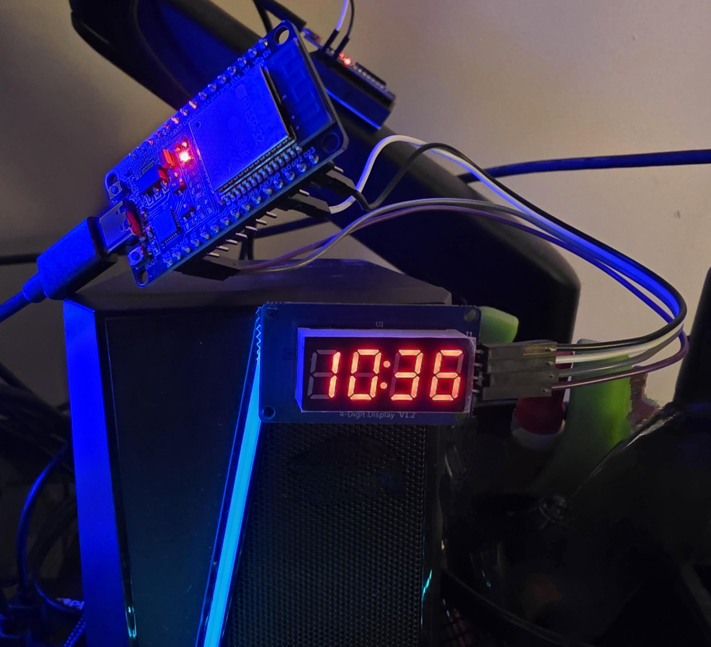

# ESP32 NTP Clock



> Additional build photos and a detailed pictorial assembly guide will be included in a future revision of this project.


A simple ESP32-based digital clock that synchronizes with NTP servers over Wi-Fi and displays local time on a TM1637 4-digit seven-segment display.

This project was built to experiment with ESP32 Wi-Fi connectivity, NTP time synchronization, and embedded display control.

> Tested using a TM1637 4-digit display powered directly from the ESP32's 3.3V pin.

## Hardware

* ESP32
* TM1637 4-digit seven-segment display
* 4x Dupont jumper wires (female-to-female)

## Wiring

| TM1637 Display | ESP32   |
| -------------- | ------- |
| VCC            | 3.3V    |
| GND            | GND     |
| CLK            | GPIO 22 |
| DIO            | GPIO 21 |

## Features

* Synchronizes time using NTP
* Automatic daylight saving time (DST) support
* 12-hour time format
* Blinking colon indicator
* Configurable time zone support

## Time Zones

Update the POSIX time zone string in the sketch to match your local time zone:

```cpp
configTzTime("PST8PDT,M3.2.0,M11.1.0", "pool.ntp.org");
```

Reference:
https://github.com/yuan910715/Esp8266_Wifi_Matrix_Clock/blob/master/posix.md